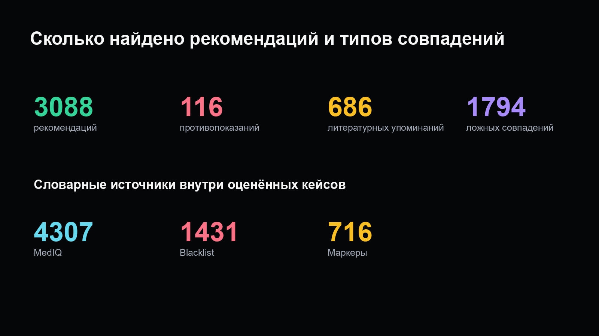
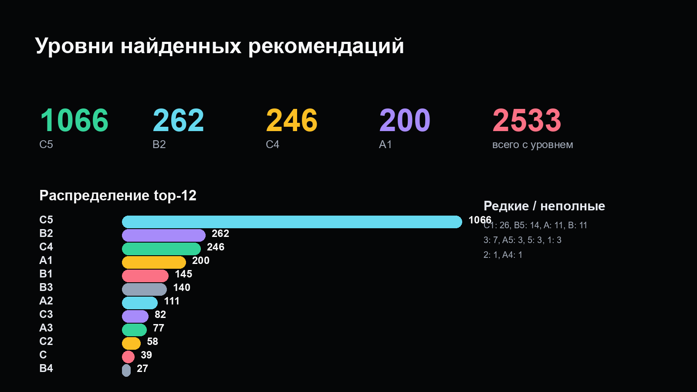
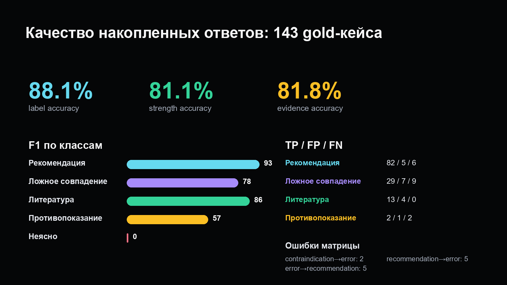

# Anal Russia Klinik 2025

Поиск и аудит упоминаний препаратов и методов лечения в российских клинических рекомендациях: словарный поиск Aho–Corasick → ручные фильтры → контекстные LLM-блоки → классификация → ручная проверка → отчёт.

Проект помогает находить контексты для дальнейшего разбора. Класс «рекомендация» означает, что модель распознала рекомендацию в тексте; это не оценка эффективности препарата.

## Актуальное состояние

Состояние файлов проверено **16 сентября 2026 года**. Последний найденный сохранённый итоговый LLM-отчёт сформирован **5 мая 2026 года, 16:17 UTC**. Более нового результата в проверенных локальных файлах и ветках GitHub не найдено.

Основной источник — [openrouter_all_results.json](Bot_for_anal_rec/reports/llm/openrouter_all_results.json). На момент сверки он побайтово совпадает с локальным итоговым файлом. Файл `openrouter_all_results.current.json` синхронизирован с основным результатом; старый промежуточный снимок сохранён как `openrouter_all_results.checkpoint-20260504.json`.

| Показатель | Значение |
|---|---:|
| Блоки с сохранёнными ответами | 4 121 |
| Видимые обработанные блоки после фильтра исключений | 4 086 |
| Оценки отдельных упоминаний внутри блоков | 5 688 |
| Клинические рекомендации в сводном CSV | 488 |
| Ошибки выполнения запросов в итоговом отчёте (`failed`) | 0 |
| Размеченные случаи в оценке качества | 143 |

Количество документов в CSV — охват этого отчёта, а не размер всего реестра Минздрава. Нулевой `failed` означает отсутствие ошибок выполнения запросов в сохранённом результате, а не отсутствие ошибок классификации.

### Состав накопленного результата

Возобновление сохраняет ранее полученные ответы. По метаданным `_openrouter.request.model` в итоговом файле:

| Модель запроса | Блоки |
|---|---:|
| `openai/gpt-5.4-mini` | 4 038 |
| `openai/gpt-5.4` | 80 |
| `openai/gpt-4-turbo` | 3 |

Верхнеуровневые поля отчёта: `model=openai/gpt-5.4-mini`, `prompt_version=llm-review-v3-multi`. Они не означают, что все сохранённые ответы получены одной моделью и одной версией промпта.

## Оценка качества LLM

Источник: раздел `score` итогового JSON и [ручная gold-разметка](Bot_for_anal_rec/reports/llm/llm_gold_40.json). Единица оценки — отдельный размеченный случай внутри блока. Несмотря на историческое имя `gold_40`, в итоговой оценке **143 случая**.

| Метрика | Совпадения с gold | Точность |
|---|---:|---:|
| Класс упоминания | 126 / 143 | 88,11% |
| Уровень убедительности рекомендаций (УУР) | 116 / 143 | 81,12% |
| Уровень достоверности доказательств (УДД) | 117 / 143 | 81,82% |

УУР и УДД сравниваются по всем 143 случаям; совпадение отсутствующих значений также засчитывается. Поэтому эти показатели не равны точности извлечения только явно указанных уровней.

| Класс | Случаев в gold | Precision | Recall | F1 |
|---|---:|---:|---:|---:|
| Рекомендация | 88 | 94,25% | 93,18% | 93,71% |
| Противопоказание | 4 | 66,67% | 50,00% | 57,14% |
| Упоминание литературы | 13 | 76,47% | 100,00% | 86,67% |
| Ошибка / ложное совпадение | 38 | 80,56% | 76,32% | 78,38% |

В gold нет случаев класса `unclear`; качество для него здесь не оценено. Для противопоказаний выборка содержит всего 4 случая. Это оценка накопленных ответов на доступной ручной разметке; независимый от настройки промптов тестовый набор не подтверждён. Старые gold-прогоны с другими выборками и форматами нельзя использовать как прямое сравнение моделей.

## Что найдено

| Класс модели | Оценок упоминаний |
|---|---:|
| Рекомендация | 3 088 |
| Противопоказание | 116 |
| Упоминание литературы | 686 |
| Ошибка / ложное совпадение | 1 794 |
| Неясно | 4 |
| **Всего** | **5 688** |

`error` здесь — класс ложного или нерелевантного словарного совпадения, а не технический сбой API.

Словарные счётчики измеряют разные величины:

| Источник | Все совпадения в оценённых кейсах | Сумма уникальных терминов по документам (CSV) |
|---|---:|---:|
| MedIQ | 4 307 | 1 925 |
| Blacklist | 1 431 | 517 |
| Маркеры | 716 | 367 |

CSV сначала удаляет повторы названия внутри каждого документа; один термин в разных документах учитывается снова. Ни одна из этих колонок не равна числу уникальных препаратов во всём корпусе. Один случай может иметь несколько словарных источников.

### Файлы результатов

- [Итоговый JSON с ответами, метриками и матрицей ошибок](Bot_for_anal_rec/reports/llm/openrouter_all_results.json).
- [CSV по 488 клиническим рекомендациям](Bot_for_anal_rec/reports/llm/openrouter_all_results.csv): UTF-8 с BOM, разделитель `;`.
- [Ручная gold-разметка](Bot_for_anal_rec/reports/llm/llm_gold_40.json).
- [Исключённые препараты](Bot_for_anal_rec/reports/llm/excluded_preparations.json).
- [Ручные фильтры словарных совпадений](Bot_for_anal_rec/reports/aho/host_word_filters.json).

CSV содержит метаданные документов, ссылки, классы, уровни и найденные термины. CSV, PNG и страницы проверки пересобраны 16 сентября 2026 из сохранённых майских данных; новые LLM-запросы не выполнялись.





## Как работает проверка

1. Загружаются тексты клинических рекомендаций и словари: MedIQ, blacklist и ручные маркеры.
2. Aho–Corasick находит кандидатов, включая подстроковые совпадения; ручные фильтры удаляют известный шум.
3. Совпадения дедуплицируются по документу и точным позициям. Соседние случаи с промежутком до 100 символов объединяются в блок; добавляется контекст до 2 500 символов с каждой стороны.
4. Перед LLM применяются исключения препаратов. Если все термины случая исключены, он не передаётся как оцениваемый случай; пустые блоки пропускаются.
5. LLM классифицирует найденное упоминание и извлекает УУР/УДД, связанные с ним. Ответы проверяются по ручной разметке.
6. Итоги агрегируются по клиническим рекомендациям в CSV.

Исходники: [основной пакет](Bot_for_anal_rec/src/anal_russia_klinik/), [LLM-проверка и расчёт метрик](Bot_for_anal_rec/src/anal_russia_klinik/llm_review_openrouter.py).

### Экспертная проверка и gold-разметка

- [Страницы экспертной проверки](Bot_for_anal_rec/reports/expert_review/index.html): 3 071 рекомендация на 8 страницах и 115 противопоказаний на отдельной странице.
- [Страницы gold-разметки](Bot_for_anal_rec/reports/gold_review/index.html): 4 086 блоков на 11 страницах.
- [Генератор экспертных страниц](Bot_for_anal_rec/tools/build_expert_review_pages.py) и [генератор gold-страниц](Bot_for_anal_rec/tools/build_gold_review_pages.py).

Скачайте/клонируйте репозиторий и откройте HTML локально: GitHub показывает исходный текст HTML. Страницы автономны, изменения сохраняются в localStorage браузера. Используйте кнопку экспорта JSON для переноса и сохранения разметки; localStorage не попадает в Git автоматически. Числа после исключения 36 препаратов отличаются от исходных классов отчёта. Подготовка страниц не означает, что все случаи уже проверены экспертом.

## Запуск

Команды выполняются из каталога `Bot_for_anal_rec/`. Требуется Python 3.11+.

```powershell
cd Bot_for_anal_rec
py -m pip install -e ".[test,reports]"
py tools/restore_snapshot.py
py tools/restore_snapshot.py --check
py Main.py run --provider fake --texts data/samples/clinical.json --markers data/samples/markers.json --blacklist data/samples/blacklist.json --preparations data/samples/preparations.json --filter-file data/samples/manual_filters.csv --output-dir reports/smoke
py -m pytest -q
```

В Linux/macOS используйте `python3` вместо `py`. Для PNG требуется шрифт Arial или DejaVu Sans (Debian/Ubuntu: пакет `fonts-dejavu-core`). Восстановление использует только стандартную библиотеку Python и не требует сети.

Пересборка всех производных отчётов без LLM-запросов:

```powershell
py tools/build_openrouter_report_artifacts.py
py tools/build_expert_review_pages.py
py tools/build_gold_review_pages.py
```

Для новых реальных запросов настройте локальный файл:

```powershell
Copy-Item config/openrouter.env.example config/openrouter.env
notepad config/openrouter.env
```

```text
OPENROUTER_API_KEY=...
OPENROUTER_MODEL=openai/gpt-5.4-mini
```

Продолжение обработки с лимитом новых вызовов:

```powershell
py reports\llm\run_openrouter_all.py --limit 100
```

`--limit` обязателен и ограничивает новые вызовы. По умолчанию ранее сохранённые ответы переиспользуются, в том числе при смене модели или версии промпта. Входные данные и `reports/llm/llm_review_cases.json` восстанавливаются из включённых сжатых снимков. Быстрый прогон `fake` проверяет работу программы без платных LLM-запросов.

Подробные команды и структура: [README рабочего проекта](Bot_for_anal_rec/README.md).

## Источники и предыдущие публикации

Источники проекта: [реестр клинических рекомендаций Минздрава](https://cr.minzdrav.gov.ru/clin-rec), [MedIQ](https://mediqlab.com/), [словарь blacklist](https://encyclopatia.ru/wiki/Расстрельный_список_препаратов). Включение термина в словарь — основание для поиска и проверки контекста.

- [Ранее опубликованная таблица](https://docs.google.com/spreadsheets/d/1ez0kcEPb7fG8E_0f7F5LrCfPg0fsiuQpH1AMKid0gX8/edit?gid=671773976#gid=671773976).
- [Результаты 2025 года](https://docs.google.com/spreadsheets/d/1H4c2ApuLdaliCj3b2HDTVYmmjIFCTOuWzcS6LjxclGM/edit?usp=sharing).
- [Результаты 2024 года](https://docs.google.com/spreadsheets/d/1C0-pqnQktmtxNsOc3cU8fobhCf_nr1RKxfv1dNGzDTQ/edit?gid=1018405073#gid=1018405073).

Содержимое внешних таблиц при этой сверке не проверялось; актуальные числа выше взяты из версионируемого JSON. Старые показатели 560 документов и 3 778 находок относятся к публикации от 3 декабря 2025 года и не описывают майский отчёт.

## Данные и ограничения

Ручные фильтры, gold-разметка, исключения и полезные LLM-ответы сохраняются в Git. API-ключи, локальные env-файлы, логи, кеши и промежуточные partial-файлы не публикуются. Корпус рекомендаций, справочник MedIQ и LLM-кейсы включены как gzip-снимки (всего около 59 МБ); после распаковки — около 549 МБ. [Манифест SHA-256](Bot_for_anal_rec/data/snapshots/manifest.json) фиксирует точные размеры и контрольные суммы. `restore_snapshot.py` не перезаписывает отличающиеся пользовательские файлы.

Сырой Aho-отчёт размером около 2 ГБ воспроизводится отдельно и не нужен для просмотра или пересборки опубликованных итогов. Отфильтрованные позиции, ручная разметка и ответы LLM уже включены.

Проверка публикации: восстановление снимков и SHA-256, 37 pytest-тестов, fake-прогон на sample-данных, сборка CSV/PNG и обеих групп HTML. Основной JSON ответов сохранён без изменения. Docker и новый платный LLM-прогон при публикации не запускались.
